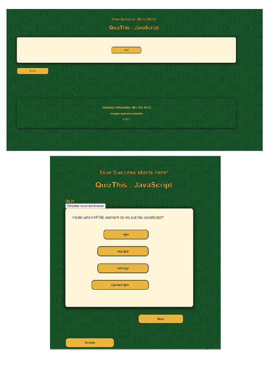
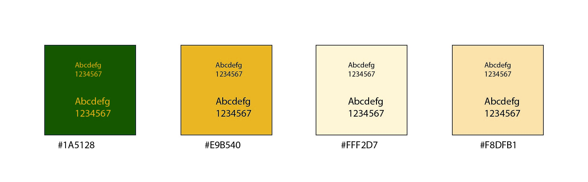

# QuizThis Timed Quiz

## Description

Quiz this is an app designed as an educational tool. 
The main objective is to allow recalling information quickly and accurately. 

Many testers get overwhelmed by sudden quizzes which may result in poor performance even though they know information. 

QuizThis is an educational tool instead of avaluating tool. Each quiz contains 5-7 questions The questions are not ramndom but help to build infomational knowledge by starting with a basic question and building on sequence of information about the topic. This allows to practice understanding of a subject fully and not just selecting a right answer. 

## Usage

QuizThis has a predetermined set of questions that is highlighted on the screen one at the time. The initial screen has a topic for testing annoucement, a description of the process and a start button. 

After the start button pushed the first questions appears with possible answers to choose from by checkmark. Each question has a buildt in timer that replenishes itself with each question. 

After the question is answered a promt appears declaring the correct answer with a link to find out more information on that question. The link opens a new browser window with information to about the answer. 

There is a next button that takes user to the next question. The process repeats until the last question is answered. 

After the last question page the user will press the button to finish the testing. The next page will provide the score and the answers to review. All answers will have a further link to further studies. 

## Features

Color scheme is dark forest green
Golden color for the title, huyperlinks  
Each question is given a off-white box whith possible answers below that can be selected as a button. THe answers are highlited on hover to darker off-white.  
Below the quiz box  appears "Agree, review here:..." or "Disagree, review here: ..." 
A link to study material bellow the argument in golden letters. 
On the right is next button to the next question in same golded color with black text. 

Inpiration credit: Web Dev Simplified "Build a Quiz app with JavaScript"

